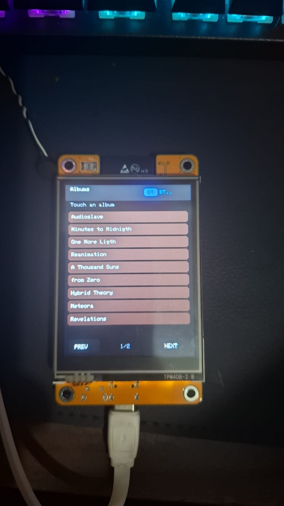
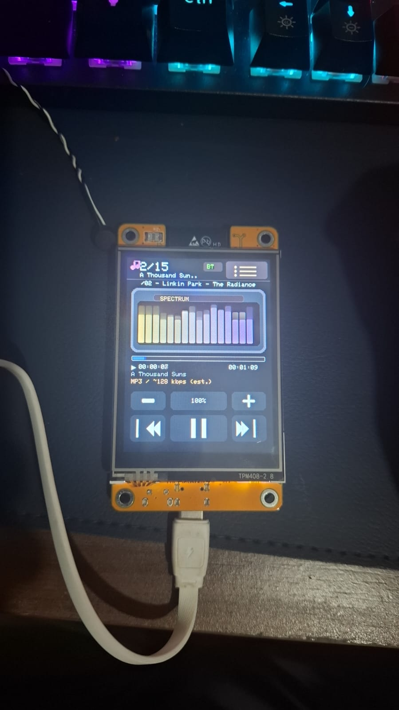

# Acknowledgements

Special thanks to **Sparkadium** and the original project **[Cheap-Yellow-MP3-Player](https://github.com/Sparkadium/Cheap-Yellow-MP3-Player)** — it helped me get back to working on this project.

# CYD Album Player

ESP32 “CYD” music player that:
- Scans your SD card by albums (folders) and plays `.mp3` / `.wav` tracks.
- Shows a **DAP-style player screen** (dark theme, status bar, **spectrum visualizer** — 16 frequency bars driven from the audio, progress bar, timestamps, technical line in cyan) plus volume **+/−** and touch transport controls.
- Uses the **on-board RGB LED** on the back as a Bluetooth / playback indicator.
- Acts as a **Bluetooth A2DP Source** (sends the audio to a Bluetooth speaker/headset).

## Screenshots

Place these JPEGs in the **repository root** (same directory as `README.md`) when you push — the Markdown below references them **by filename**.

| File | What it shows |
|------|----------------|
| **`AlbumPlaylist.jpeg`** | **Album browser:** folder list, **Player** button in the header (return to playback when tracks exist), **play** button on the path row (same action), **PREV/NEXT** paging, BT status in the header. |
| **`Execution_screen.jpeg`** | **Playback screen:** spectrum (“SPECTRUM”) bars, track title, progress and times, album line, technical line, volume **−/+%/+**, transport controls, list icon (top-right). |





## RGB status LED (rear of CYD)

On typical **ESP32-2432S028R** boards, the rear RGB LED uses three GPIOs and is **active-low** (LOW = LED on):

| Channel | GPIO |
|--------|------|
| Red    | 4    |
| Green  | 16   |
| Blue   | 17   |

**Behaviour in this sketch**

| State | LED pattern |
|-------|-------------|
| Bluetooth **not** connected (pairing / searching) | Alternating **red** and **blue** blink. |
| Bluetooth connected and track **playing** | Alternating **green** and **blue** (one colour on at a time, ~450 ms). |
| Bluetooth connected but **paused** / **stopped** | LED off. |

At startup, while Bluetooth is scanning or pairing, the sketch runs the same LED update routine so the LED animates until a headset/speaker connects.

Clones may use different pins or polarity; adjust `RGB_LED_RED` / `RGB_LED_GREEN` / `RGB_LED_BLUE` in `CYDAlbumPlayer.ino` if needed.

**Note (front “R21” / clear dome):** On many CYD boards, silkscreen **R21** is a **resistor** designator, not a separate software-driven LED. A clear component on the front is often the **LDR** (light sensor on GPIO 34) — it is read as an analog input, not toggled like the RGB LED.

## Player UI (main playback screen)

The playback view is laid out for a **240×320** portrait panel and is inspired by compact digital audio players (high contrast, minimal chrome).

- **Top bar:** note icon, **track index / total**, **album folder name** (truncated), **BT** badge, **list icon** (top-right) to open the **album list** without stopping playback.
- **Title line:** current track name (file name without extension), centered above the visualizer.
- **Spectrum panel (“SPECTRUM”):** **16 vertical bars** that respond to the music. The sketch taps **mono samples** (L+R after volume gain) from the audio path, runs a **Hamming-windowed block** (256 samples) and **Goertzel** filters at fixed frequencies (~80 Hz–18 kHz). **Per-band AGC** and treble boost keep highs visible; MP3 assumes **44.1 kHz** sample rate for bin mapping (WAV uses the parsed rate). The bar area refreshes ~20×/s while the player screen is shown; bars decay when paused/stopped.
- **Volume row:** **− / percentage / +** touch buttons (see `PL_VOLUME_Y`).
- **Info block (updated ~every 450 ms while playing or paused):**
  - Thin **progress bar** (red fill when duration is known).
  - **Elapsed** and **total** time as `HH:MM:SS`; total shows `--:--:--` when duration is unknown.
  - Folder line (dim text).
  - **Cyan** technical line: **`WAV / sample-rate Hz / PCM`** when parsed from the file header, or **`MP3 / ~128 kbps (approx.)`** for MP3.

**Timing**

- Elapsed time respects **pause / resume** (wall-clock with accumulated pause duration).
- **WAV** duration and sample rate come from parsing `fmt` / `data` chunks on the SD card.
- **MP3** total length and bitrate are **estimated** from file size (assumes ~128 kbps CBR); VBR or unusual files may be off — the UI labels MP3 as estimated.

**Touch targets**

- **List icon** (top-right, `PL_BACK_BTN_*`) switches to the album browser; **playback continues** (pause/play state unchanged).
- **Player** (browser header, when tracks exist) or the **play** button on the path row below: returns to the playback screen **without** restarting the track.
- Tapping a **different album** in the list **stops the current decode briefly** before scanning the new folder on the SD card (avoids SPI/SD contention with MP3 streaming, which used to cause Bluetooth stutter). Then playback starts from track 1 of the new album. While browsing (list open), the sketch also **pumps the audio decoder** during TFT redraws and touch waits so the buffer stays fuller.
- **Prev / Play–Pause / Next** are in the bottom transport bar (see `PL_TRANSPORT_Y` in the sketch).

## Hardware / Pinout used by this sketch

The pin mapping in this project is defined in `CYDAlbumPlayer.ino` and matches the included TFT configuration file (`Setup_User.h`).

- SD card (SPI):
  - `SD_CS = 5` (`#define SD_CS 5`)
- TFT backlight:
  - `TFT_BL = 21` (`#define TFT_BL 21`)
- Touch controller (XPT2046 on its own HSPI bus):
  - `TOUCH_CLK = 25`
  - `TOUCH_MISO = 39`
  - `TOUCH_MOSI = 32`
  - `TOUCH_CS = 33`
  - `TOUCH_IRQ = 36`

The TFT drawing and SPI TFT pins (TFT_MISO/TFT_MOSI/TFT_SCLK/TFT_CS/TFT_DC/…) are configured by TFT_eSPI using `Setup_User.h`.

## TFT Setup (must match your exact CYD display variant)

This repository includes a reference copy of the TFT_eSPI setup file as `Setup_User.h`.

### 1) Install/use this setup in your TFT_eSPI library

TFT_eSPI does not automatically read `Setup_User.h` from the project root. You must apply it to your TFT_eSPI installation.

1. Open `Setup_User.h` (in this project).
2. Copy its contents (or replace the file) into your TFT_eSPI library folder:
   - `Documents/Arduino/libraries/TFT_eSPI/User_Setup.h`

### 2) Select the correct display driver (critical)

Your CYD boards come in multiple display controller variants. In `Setup_User.h`, choose exactly ONE driver:

- `ILI9341_DRIVER` (v1 original, 1× Micro-USB)
- `ILI9341_2_DRIVER` (v1 alternative controller, 1× Micro-USB)
- `ST7789_2_DRIVER` (v2/v3 newer, USB-C + Micro)

If the screen is blank/white:
- Try `ILI9341_DRIVER` first (then switch to `ILI9341_2_DRIVER` if needed).
- If your board has 2 USB ports (USB-C + Micro), use `ST7789_2_DRIVER`.

### 3) Color order / inversion fixes (if colors look wrong)

In `Setup_User.h`:
- If colors have red/blue swapped, change `TFT_RGB_ORDER` (between `TFT_RGB` and `TFT_BGR`).
- If you use `ST7789_2_DRIVER` and colors look washed/inverted, uncomment `TFT_INVERSION_ON`.

### 4) Gamma tweak in the sketch

`CYDAlbumPlayer.ino` applies a small gamma adjustment intended for the `ILI9341_2` driver:
- `tft.writecommand(0x26); ...`

If you switch your driver to something else (e.g., ST7789), and the colors look off, consider commenting out that gamma block or adjust it.

## Bluetooth device selection (fixed name removed)

**Update:** Bluetooth pairing no longer uses a hard-coded speaker name in the sketch. On each boot the player **scans for nearby audio devices** (A2DP sink class), **lists them on the touchscreen** (with signal strength), and you **tap the headset or speaker** you want. The UI proceeds to the SD music browser only **after** A2DP connects.

Implementation notes:

- Startup uses `BluetoothA2DPSource` with a **SSID / inquiry callback** to collect discovered devices and to accept the **address** of the one you tapped.
- **Auto-reconnect is turned off** on boot and the **last saved peer is cleared** so the device always goes through the picker (you are not locked to one fixed name such as the old `"E6"` example).
- Only devices that report a compatible **Class of Device** (audio/rendering, as filtered by ESP32-A2DP) appear in the list.

After the **WELCOME** splash, you may see **“Preparing Bluetooth…”** briefly, then the picker screen (**“Bluetooth — pick speaker”**, **“Scanning…”**, **“Tap a device:”**). There can be a short delay before the first scan results while the stack initialises.

## SD Card layout expected by this project

The code expects:
- Album = a folder under the SD card root (`/`)
- Track files inside each album folder
  - `.mp3`
  - `.wav`

The project ignores a known Windows folder:
- `System Volume Information`

**Track order inside an album:** files are sorted **alphabetically by full path** (e.g. `/Album/track01.mp3` before `/Album/track02.mp3`). No ID3/metadata is read for ordering.

## Startup splash (optional high-quality logo)

On boot, after the SD card is mounted, the sketch shows a **WELCOME** screen and either:

1. **Your own logo** from the SD card, or  
2. A **built-in procedural** GUARA CREW–style drawing (fallback).

### Custom logo file (recommended for a perfect match)

Place a **raw RGB565** file on the SD card root:

- **Path:** `/guara565.raw` (exact name)
- **Size:** exactly **200 × 218** pixels × 2 bytes = **87 200 bytes**
- **Format:** row-major, **16-bit RGB565**, **little-endian** per pixel (standard for ESP/TFT_eSPI `pushImage`)

If the file is missing or the size is wrong, the procedural logo is used instead.

You can generate the file with a small Python script (resize your PNG first):

```python
from PIL import Image

W, H = 200, 218
img = Image.open("logo.png").convert("RGB").resize((W, H))
out = bytearray()
for y in range(H):
    for x in range(W):
        r, g, b = img.getpixel((x, y))
        c = ((r & 0xF8) << 8) | ((g & 0xFC) << 3) | (b >> 3)
        out += bytes((c & 0xFF, c >> 8))  # little-endian
open("guara565.raw", "wb").write(out)
```

Copy `guara565.raw` to the root of the SD card.

## Touch calibration (optional)

If touch points don’t match the buttons/menu areas, tune the calibration constants in `CYDAlbumPlayer.ino`:
- `TS_MINX`, `TS_MAXX`, `TS_MINY`, `TS_MAXY`

## Libraries used (typical)

You need these dependencies available in Arduino IDE:
- `TFT_eSPI`
- `XPT2046_Touchscreen`
- `ESP32-A2DP` (Phil Schatzmann)
- `ESP8266Audio` (provides `AudioFileSourceSD`, `AudioGeneratorMP3`, `AudioGeneratorWAV`, `AudioOutput`)

## Build & upload

1. Select your ESP32 board in Arduino IDE.
2. Ensure TFT_eSPI is configured using the `Setup_User.h` reference.
3. Compile and upload `CYDAlbumPlayer.ino`. On first run after upload, use the on-screen list to pick your Bluetooth speaker or headset.

If you want, paste the last ~30 lines of your Arduino compile log (especially the first real `error:` if any) and I can help confirm board/driver configuration.

