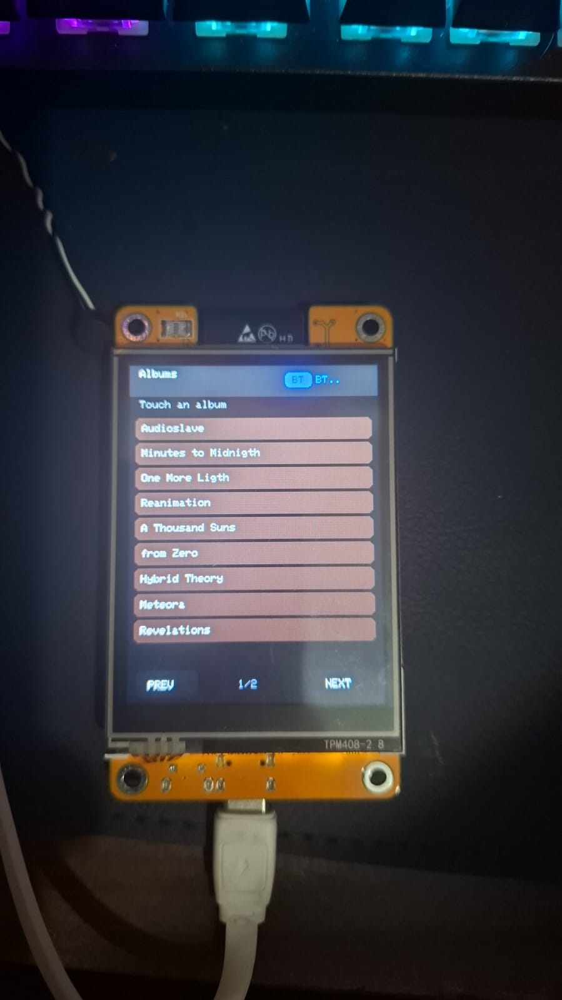
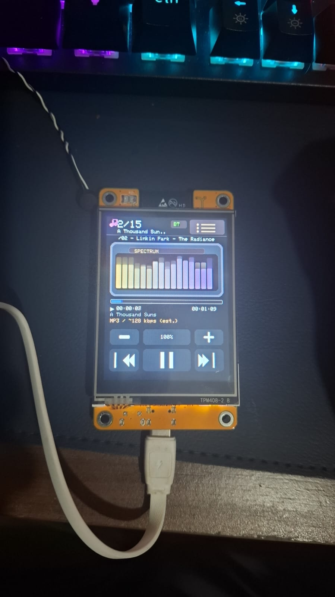

# Agradecimentos

Agradecimento especial ao **Sparkadium** e ao projeto original **[Cheap-Yellow-MP3-Player](https://github.com/Sparkadium/Cheap-Yellow-MP3-Player)** — ele me ajudou a voltar a trabalhar neste projeto.

# CYD Album Player

**Idioma:** [English](README.md) | **Português (BR)**

Player de música para ESP32 “CYD” que:
- Percorre o cartão SD por álbuns (pastas) e toca faixas `.mp3` / `.wav`.
- Mostra uma **tela de player no estilo DAP** (tema escuro, barra de status, **visualizador de espectro** — 16 barras de frequência guiadas pelo áudio, barra de progresso, timestamps, linha técnica em ciano), além de volume **+/−** e controles de transporte por toque.
- Usa o **LED RGB traseiro** como indicador de Bluetooth / reprodução.
- Atua como **fonte Bluetooth A2DP** (envia o áudio para caixa de som / fone Bluetooth).
- **Configuração Bluetooth:** na inicialização, **varre dispositivos de áudio próximos** e permite **escolher caixa/fone numa lista touch** (sem nome fixo no código).
- **Energia do display:** após **30 segundos** sem toque, o **backlight desliga**; o **toque é ignorado** enquanto estiver apagado; o botão **BOOT** (**GPIO 0**) **alterna** o backlight ligado/desligado (Bluetooth e reprodução continuam).

## Capturas de tela

Coloque estes JPEGs na **raiz do repositório** (mesmo diretório do `README.md`) ao publicar — o Markdown abaixo referencia-os **pelo nome do arquivo**.

| Arquivo | O que mostra |
|---------|----------------|
| **`AlbumPlaylist.jpeg`** | **Navegador de álbuns:** lista de pastas, botão **Player** no cabeçalho (voltar à reprodução quando houver faixas), botão **play** na linha do caminho (mesma ação), paginação **PREV/NEXT**, status BT no cabeçalho. |
| **`Execution_screen.jpeg`** | **Tela de reprodução:** barras de espectro (“SPECTRUM”), título da faixa, progresso e tempos, linha do álbum, linha técnica, volume **−/+%/+**, controles de transporte, ícone de lista (canto superior direito). |





## LED RGB de status (traseira do CYD)

Nas placas típicas **ESP32-2432S028R**, o LED RGB traseiro usa três GPIOs e é **ativo em nível baixo** (LOW = LED aceso):

| Canal | GPIO |
|-------|------|
| Vermelho | 4  |
| Verde    | 16 |
| Azul     | 17 |

**Comportamento neste sketch**

| Estado | Padrão do LED |
|--------|----------------|
| Bluetooth **não** conectado (pareamento / busca) | Piscar alternado **vermelho** e **azul**. |
| Bluetooth conectado e faixa **tocando** | Alternância **verde** e **azul** (uma cor por vez, ~450 ms). |
| Bluetooth conectado mas **pausado** / **parado** | LED apagado. |

Na inicialização, enquanto o Bluetooth está varrendo ou pareando, o sketch executa a mesma rotina de atualização do LED para que ele anime até um fone/caixa conectar.

Clones podem usar pinos ou polaridade diferentes; ajuste `RGB_LED_RED` / `RGB_LED_GREEN` / `RGB_LED_BLUE` em `CYDAlbumPlayer.ino` se necessário.

**Nota (“R21” / cúpula transparente na frente):** Em muitas placas CYD, a serigrafia **R21** é uma referência de **resistor**, não um LED controlado por software. Um componente transparente na frente costuma ser o **LDR** (sensor de luz no GPIO 34) — é lido como entrada analógica, não comutado como o LED RGB.

## Interface do player (tela principal de reprodução)

A vista de reprodução é feita para um painel **240×320** em retrato e inspira-se em players de áudio digitais compactos (alto contraste, pouco “chrome”).

- **Barra superior:** ícone de nota, **índice / total de faixas**, **nome da pasta do álbum** (truncado), badge **BT**, **ícone de lista** (canto superior direito) para abrir a **lista de álbuns** sem interromper a reprodução.
- **Linha do título:** nome da faixa atual (nome do arquivo sem extensão), centralizado acima do visualizador.
- **Painel de espectro (“SPECTRUM”):** **16 barras verticais** que respondem à música. O sketch coleta **amostras mono** (L+R após ganho de volume) do caminho de áudio, aplica um **bloco com janela de Hamming** (256 amostras) e filtros **Goertzel** em frequências fixas (~80 Hz–18 kHz). **AGC por banda** e reforço de agudos mantêm os altos visíveis; MP3 assume taxa de **44,1 kHz** para o mapeamento dos bins (WAV usa a taxa parseada). A área das barras atualiza ~20×/s enquanto a tela do player está visível; as barras decaem quando pausado/parado.
- **Linha de volume:** botões touch **− / porcentagem / +** (ver `PL_VOLUME_Y`).
- **Bloco de informações (atualizado ~a cada 450 ms enquanto tocando ou pausado):**
  - **Barra de progresso** fina (preenchimento vermelho quando a duração é conhecida).
  - Tempo **decorrido** e **total** como `HH:MM:SS`; o total mostra `--:--:--` quando a duração é desconhecida.
  - Linha da pasta (texto mais apagado).
  - Linha técnica em **ciano**: **`WAV / taxa-de-amostragem Hz / PCM`** quando parseada do cabeçalho do arquivo, ou **`MP3 / ~128 kbps (aprox.)`** para MP3.

**Temporização**

- O tempo decorrido respeita **pausa / retomada** (relógio de parede com duração de pausa acumulada).
- Duração e taxa de amostragem de **WAV** vêm do parse dos chunks `fmt` / `data` no cartão SD.
- Comprimento total e bitrate de **MP3** são **estimados** pelo tamanho do arquivo (assume ~128 kbps CBR); VBR ou arquivos atípicos podem errar — a UI marca MP3 como estimado.

**Áreas de toque**

- O **ícone de lista** (canto superior direito, `PL_BACK_BTN_*`) muda para o navegador de álbuns; a **reprodução continua** (estado pause/play inalterado).
- **Player** (cabeçalho do navegador, quando há faixas) ou o botão **play** na linha do caminho abaixo: volta à tela de reprodução **sem** reiniciar a faixa.
- Tocar em um **álbum diferente** na lista **pausa brevemente a decodificação atual** antes de varrer a nova pasta no SD (evita contenção SPI/SD com o streaming de MP3, que costumava causar engasgos no Bluetooth). Em seguida a reprodução começa na faixa 1 do novo álbum. Enquanto navega (lista aberta), o sketch também **alimenta o decoder de áudio** durante redesenhos do TFT e esperas de toque para manter o buffer mais cheio.
- **Anterior / Play–Pause / Próxima** ficam na barra de transporte inferior (ver `PL_TRANSPORT_Y` no sketch).

## Hardware / pinagem usada por este sketch

O mapeamento de pinos deste projeto está definido em `CYDAlbumPlayer.ino` e coincide com o arquivo de configuração TFT incluído (`Setup_User.h`).

- Cartão SD (SPI):
  - `SD_CS = 5` (`#define SD_CS 5`)
- Backlight do TFT:
  - `TFT_BL = 21` (`#define TFT_BL 21`) — `HIGH` liga o backlight neste sketch; `LOW` desliga.
- Botão **BOOT** (tecla da placa usada no firmware):
  - `BOOT_BUTTON_PIN = 0` — lido com `INPUT_PULLUP`; **pressionado** = LOW. Usado como **alternância com debounce** do backlight (ver **Energia do display e toque** abaixo). **GPIO 0 é pino de strapping do ESP32:** se o BOOT estiver em nível baixo enquanto o chip **reseta**, o módulo pode entrar em **modo download / gravação** em vez de rodar o sketch; solte o BOOT e resetar para boot normal.
- Controlador touch (XPT2046 no próprio barramento HSPI):
  - `TOUCH_CLK = 25`
  - `TOUCH_MISO = 39`
  - `TOUCH_MOSI = 32`
  - `TOUCH_CS = 33`
  - `TOUCH_IRQ = 36`

O desenho no TFT e os pinos SPI do TFT (TFT_MISO/TFT_MOSI/TFT_SCLK/TFT_CS/TFT_DC/…) são configurados pelo TFT_eSPI via `Setup_User.h`.

## Configuração do TFT (deve bater com a variante exata do seu CYD)

Este repositório inclui uma cópia de referência do arquivo de setup do TFT_eSPI como `Setup_User.h`.

### 1) Instalar/usar este setup na biblioteca TFT_eSPI

O TFT_eSPI **não** lê automaticamente o `Setup_User.h` da raiz do projeto. Você precisa aplicá-lo na instalação da biblioteca TFT_eSPI.

1. Abra `Setup_User.h` (neste projeto).
2. Copie o conteúdo (ou substitua o arquivo) na pasta da biblioteca TFT_eSPI:
   - `Documents/Arduino/libraries/TFT_eSPI/User_Setup.h`

### 2) Selecionar o driver de display correto (crítico)

As placas CYD vêm com várias variantes de controlador de display. Em `Setup_User.h`, escolha exatamente UM driver:

- `ILI9341_DRIVER` (v1 original, 1× Micro-USB)
- `ILI9341_2_DRIVER` (v1 controlador alternativo, 1× Micro-USB)
- `ST7789_2_DRIVER` (v2/v3 mais novos, USB-C + Micro)

Se a tela estiver em branco/branco:
- Tente `ILI9341_DRIVER` primeiro (depois mude para `ILI9341_2_DRIVER` se precisar).
- Se a placa tiver 2 portas USB (USB-C + Micro), use `ST7789_2_DRIVER`.

### 3) Correções de ordem de cor / inversão (se as cores estiverem erradas)

Em `Setup_User.h`:
- Se vermelho/azul estiverem trocados, altere `TFT_RGB_ORDER` (entre `TFT_RGB` e `TFT_BGR`).
- Se usar `ST7789_2_DRIVER` e as cores parecerem lavadas/invertidas, descomente `TFT_INVERSION_ON`.

### 4) Ajuste de gama no sketch

`CYDAlbumPlayer.ino` aplica um pequeno ajuste de gama pensado para o driver `ILI9341_2`:
- `tft.writecommand(0x26); ...`

Se mudar o driver para outro (ex.: ST7789) e as cores ficarem estranhas, considere comentar esse bloco de gama ou ajustá-lo.

## Seleção de dispositivo Bluetooth (nome fixo removido)

**Atualização:** o pareamento Bluetooth **não** usa mais um nome de caixa fixo no sketch. A cada boot o player **varre dispositivos de áudio próximos** (classe sink A2DP), **lista-os na tela touch** (com intensidade do sinal), e você **toca no fone ou caixa** desejado. A UI só segue para o navegador de música no SD **depois** da conexão A2DP.

Notas de implementação:

- A inicialização usa `BluetoothA2DPSource` com um **callback de SSID / inquiry** para coletar dispositivos descobertos e aceitar o **endereço** do que você tocou.
- A **reconexão automática é desligada** no boot e o **último peer salvo é limpo**, para o dispositivo sempre passar pelo seletor (você não fica preso a um nome fixo como o antigo exemplo `"E6"`).
- Só aparecem na lista dispositivos que reportam uma **Class of Device** compatível (áudio/renderização, filtrada pelo ESP32-A2DP).

Após o splash **WELCOME**, você pode ver brevemente **“Preparing Bluetooth…”**, depois a tela de seleção (**“Bluetooth — pick speaker”**, **“Scanning…”**, **“Tap a device:”**). Pode haver um atraso curto antes dos primeiros resultados enquanto a stack inicializa.

## Energia do display e toque (timeout do backlight, alternância pelo BOOT)

O sketch trata **“tela desligada”** como **backlight apagado** em **`TFT_BL` (GPIO 21)**. O controlador TFT mantém a última imagem na memória; só o backlight é comutado, então reprodução e Bluetooth **não** param.

| Comportamento | Detalhe |
|---------------|---------|
| **Timeout de ociosidade** | Se **não houver interação válida no touchscreen** por **`DISPLAY_IDLE_OFF_MS`** (padrão **30 segundos**, em `CYDAlbumPlayer.ino`), o backlight vai para **LOW** e o display parece apagado. |
| **Toque com tela “apagada”** | **`handleTouch()`** e o handler do **seletor Bluetooth** **retornam imediatamente** com o backlight off: o código **não** lê o controlador touch para ações de UI, então batidas no painel não mudam faixa, volume ou estado do navegador. |
| **Botão BOOT** | Um **pressionamento curto** no interruptor **BOOT** (**GPIO 0**, com debounce em software) **alterna** o backlight: **ligado → desligado** ou **desligado → ligado**. Ao religar, o **navegador de álbuns ou a tela do player é redesenhada** uma vez para a UI bater com o estado atual. |
| **Escurecimento automático vs manual** | A mesma alternância pelo **BOOT** funciona tanto se o backlight foi desligado pelo **timer de ociosidade** quanto por **pressionar BOOT** com a tela ligada. |
| **Com backlight apagado** | A lógica do **LED RGB** continua. **A2DP** e a **decodificação de áudio** seguem. Atualizações da **barra de progresso** e do **espectro** são **puladas** (menos tráfego SPI enquanto você não vê o painel). |
| **Seletor Bluetooth** | Durante o pareamento na inicialização, o **timeout de ociosidade** e o **BOOT** ainda valem; o **toque é ignorado** se o backlight estiver apagado — use o **BOOT** para ligar o painel de novo se precisar. |

**Ajuste:** altere **`DISPLAY_IDLE_OFF_MS`** perto do topo de `CYDAlbumPlayer.ino` se quiser um timeout maior ou menor.

**Nota de clone / hardware:** Algumas revisões CYD ligam o backlight de forma diferente (sempre ligado ou lógica invertida). Se **ligado/desligado** parecer invertido, troque os níveis **`HIGH`** / **`LOW`** usados para **`TFT_BL`** no sketch.

## Layout do cartão SD esperado por este projeto

O código espera:
- Álbum = uma pasta na raiz do cartão SD (`/`)
- Arquivos de faixa dentro de cada pasta de álbum
  - `.mp3`
  - `.wav`

O projeto ignora uma pasta conhecida do Windows:
- `System Volume Information`

**Ordem das faixas dentro de um álbum:** os arquivos são ordenados **alfabeticamente pelo caminho completo** (ex.: `/Album/track01.mp3` antes de `/Album/track02.mp3`). Nenhum ID3/metadado é lido para ordenação.

## Splash de inicialização (logo de alta qualidade opcional)

No boot, depois de montar o cartão SD, o sketch mostra uma tela **WELCOME** e usa:

1. **Seu próprio logo** do cartão SD, ou  
2. Um desenho **procedural embutido** no estilo GUARA CREW (fallback).

### Arquivo de logo personalizado (recomendado para ficar fiel)

Coloque um arquivo **RGB565 raw** na raiz do cartão SD:

- **Caminho:** `/guara565.raw` (nome exato)
- **Tamanho:** exatamente **200 × 218** pixels × 2 bytes = **87 200 bytes**
- **Formato:** row-major, **RGB565 de 16 bits**, **little-endian** por pixel (padrão para ESP/TFT_eSPI `pushImage`)

Se o arquivo estiver ausente ou com tamanho errado, o logo procedural é usado.

Você pode gerar o arquivo com um script Python pequeno (redimensione o PNG antes):

```python
from PIL import Image

W, H = 200, 218
img = Image.open("logo.png").convert("RGB").resize((W, H))
out = bytearray()
for y in range(H):
    for x in range(W):
        r, g, b = img.getpixel((x, y))
        c = ((r & 0xF8) << 8) | ((g & 0xFC) << 3) | (b >> 3)
        out += bytes((c & 0xFF, c >> 8))  # little-endian
open("guara565.raw", "wb").write(out)
```

Copie `guara565.raw` para a raiz do cartão SD.

## Calibração do toque (opcional)

Se os pontos de toque não baterem com os botões/áreas do menu, ajuste as constantes de calibração em `CYDAlbumPlayer.ino`:
- `TS_MINX`, `TS_MAXX`, `TS_MINY`, `TS_MAXY`

## Bibliotecas usadas (típico)

Você precisa destas dependências disponíveis no Arduino IDE:
- `TFT_eSPI`
- `XPT2046_Touchscreen`
- `ESP32-A2DP` (Phil Schatzmann)
- `ESP8266Audio` (fornece `AudioFileSourceSD`, `AudioGeneratorMP3`, `AudioGeneratorWAV`, `AudioOutput`)

## Build e upload

1. Selecione a placa ESP32 no Arduino IDE.
2. Garanta que o TFT_eSPI está configurado com a referência `Setup_User.h`.
3. Compile e faça o upload de `CYDAlbumPlayer.ino`. Na primeira execução após o upload, use a lista na tela para escolher a caixa ou fone Bluetooth.

Se quiser, cole as últimas ~30 linhas do log de compilação do Arduino (principalmente o primeiro `error:` real, se houver) e eu ajudo a confirmar a configuração da placa/driver.
